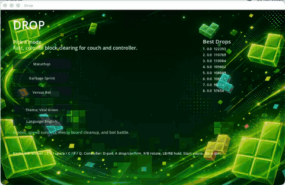

# Drop

Drop is a bright, controller-friendly falling-block puzzle game prototype built with Godot 4.

## Demo



## Current modes

- Marathon: survive as the drop speed increases over time.
- Garbage Sprint: start with a messy board and clear it as quickly as possible.
- Versus Bot: clear multiple lines to send garbage to a simple bot opponent.
- Six Pack: a solo challenge using simpler 4-6 block connected pieces with fixed starting drop speed.

## Difficulty

Marathon supports Easy and Normal difficulty. Normal uses the current speed curve. Easy follows the same curve until 100,000 points, then later speed increases are slowed to one-sixth of the Normal rate.

## Themes and languages

Drop includes six background themes:

- Vital Green
- Ocean Blue
- Sunrise Orange
- Sport Black
- Pulse Red
- Glacier Cyan

Each theme has its own vivid arcade background artwork. The in-game UI supports English and Chinese.

## Mobile play

Godot can export Drop to iOS and Android. The game is designed for landscape play on phones and shows on-screen touch controls automatically on touch devices.

Touch controls:

- Left/right/soft drop: left-side buttons
- Hard drop, rotate, hold: right-side buttons
- Pause/menu: top-right button

## Controls

Keyboard:

- Move: arrow keys or A/D
- Soft drop: down or S
- Hard drop: Space
- Rotate: Up/X and Z
- Hold: C
- Pause/resume: P
- Pause / confirm quit while paused: Esc
- Give up and return to menu: Q, with confirmation
- Cycle theme: T
- Toggle language: L
- Menu navigation: Up/Down, Enter/Space to activate the selected item

Gamepad:

- Move: D-pad or left stick
- Soft drop: D-pad down or left stick down
- Hard drop / confirm: A
- Rotate: X/B
- Hold: LB/RB
- Pause / confirm quit while paused: Start
- Give up and return to menu: Select/Back or Guide, with confirmation
- Menu navigation: D-pad/left stick up/down, A to activate the selected item

## Run locally

Install Godot 4.6 or newer, then open this folder as a Godot project.

From Terminal:

```sh
godot --path /Users/bill/Documents/drop
```

Scores are stored locally in Godot's `user://scores.json`.

## Publishing note

Drop should stay visually and commercially distinct from official Tetris products: use the Drop name, original art, original audio, and avoid Tetris trademarks in marketing or store metadata.
